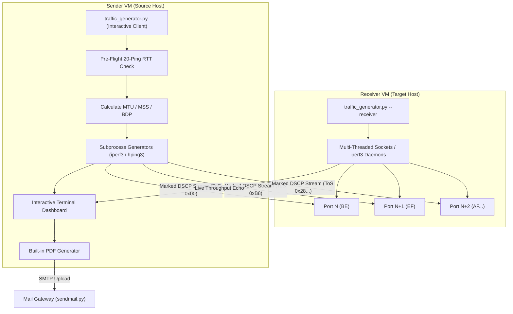

# QoS Throughput Traffic Generator

[](https://www.python.org/downloads/)
[](https://en.wikipedia.org/wiki/Linux)
[](#traffic-generation-engines)
[](#manual-page)

An advanced, interactive command-line tool designed for **telecom, network, and systems engineering teams** to validate and stress-test Quality of Service (QoS) forwarding paths across Linux VMs. 

By automating sequential port mappings, calculating key transport-layer limits (like Bandwidth-Delay Product), bypassing kernel ICMP rate-limiters, and executing concurrent class-specific marked streams, this generator offers a professional environment to verify Ingress/Egress queue behavior, SLA policies, and traffic shaping constraints.

---

## Table of Contents

- [Key Features](#key-features)
- [Architecture & Flow](#architecture--flow)
- [QoS Classification Registry](#qos-classification-registry)
- [Path Engineering Mathematics](#path-engineering-mathematics)
- [System Prerequisites](#system-prerequisites)
- [Installation & Setup](#installation--setup)
- [Usage Guide](#usage-guide)
  - [1. Receiver / Server Mode](#1-receiver--server-mode)
  - [2. Generator / Client Mode](#2-generator--client-mode)
  - [3. Running a Dry-Run](#3-running-a-dry-run)
- [SMTP Email Dispatch Integration](#smtp-email-dispatch-integration)
- [Manual Page (man)](#manual-page-man)
- [License](#license)

---

## Key Features

- **16-Class QoS Mapping Registry**: Implements standard DSCP/ToS mappings including Best-Effort (BE), Expedited Forwarding (EF), Network Control (NC), Assured Forwarding (AF), and Low/High priority queues.
- **Dynamic Network Calculations**: Reads local routing tables and interface parameters to compute MTU, MSS, Bandwidth Delay Product (BDP), Optimal TCP Window, and per-class token-refill intervals.
- **Dual Engine Backends**: Seamless support for both `iperf3` (for high-throughput bandwidth characterization) and `hping3` (for microsecond-interval packet blasting).
- **Socket Receiver Daemon**: Custom multi-threaded Python TCP/UDP socket server that reports traffic stats live on a terminal dashboard, eliminating external daemon dependencies.
- **Live iftop Integration**: Captures real-time interface throughput at 30-second intervals and visualizes packet headers on the dashboard.
- **No-Dependency PDF Reporting**: Built-in PDF compiler creates a vector-based, multi-page report containing host details, RTT, BDP metrics, a custom graphical speedometer gauge, and periodic `iftop` snapshots.
- **Secure Email Delivery**: Directly prompts to dispatch the generated PDF report to engineering management using TLS/SSL-enabled SMTP servers.
- **Kernel Rate-Limit Bypass**: Safely adjusts `/proc/sys/net/ipv4/icmp_ratelimit` and restores kernel states automatically on completion.

---

## Architecture & Flow

The tool establishes a controlled VM-to-VM test bed where DSCP-marked streams are transmitted to a corresponding sequential multi-port listener daemon on the receiver host:



---

## QoS Classification Registry

The tool uses standard DSCP mappings. Each DSCP decimal value is bit-shifted left by 2 positions to generate the 8-bit IPv4 Type of Service (ToS) byte:

| DSCP Name | DSCP Dec | DSCP Bin | FC ID | Forwarding Class | Label | Profile | ToS Hex | ToS Dec |
| :--- | :---: | :---: | :---: | :--- | :---: | :---: | :---: | :---: |
| **default** | 0 | `000000` | 0 | Best-Effort | BE | Out | `0x00` | 0 |
| **af11** | 10 | `001010` | 2 | Assured | AF | In | `0x28` | 40 |
| **af12** | 12 | `001100` | 2 | Assured | AF | Out | `0x30` | 48 |
| **af13** | 14 | `001110` | 2 | Assured | AF | Out | `0x38` | 56 |
| **af21** | 18 | `010010` | 3 | Low-1 | L1 | In | `0x48` | 72 |
| **af22** | 20 | `010100` | 3 | Low-1 | L1 | Out | `0x50` | 80 |
| **af23** | 22 | `010110` | 3 | Low-1 | L1 | Out | `0x58` | 88 |
| **af31** | 26 | `011010` | 3 | Low-1 | L1 | In | `0x68` | 104 |
| **af32** | 28 | `011100` | 3 | Low-1 | L1 | Out | `0x70` | 112 |
| **af33** | 30 | `011110` | 3 | Low-1 | L1 | Out | `0x78` | 120 |
| **af41** | 34 | `100010` | 4 | High-2 | H2 | In | `0x88` | 136 |
| **af42** | 36 | `100100` | 4 | High-2 | H2 | Out | `0x90` | 144 |
| **af43** | 38 | `100110` | 4 | High-2 | H2 | Out | `0x98` | 152 |
| **ef** | 46 | `101110` | 5 | Expedited | EF | In | `0xB8` | 184 |
| **nc1** | 48 | `110000` | 6 | High-1 | H1 | In | `0xC0` | 192 |
| **nc2** | 56 | `111000` | 7 | Network Control | NC | In | `0xE0` | 224 |

---

## Path Engineering Mathematics

Before launching background traffic streams, the engine dynamically runs the following calculations based on incoming RTT and selected rate allocations:

### 1. Maximum Segment Size (MSS)
Calculated from the outgoing interface Path MTU to avoid IP fragmentation:
$$\text{MSS} = \text{MTU} - 40 \text{ Bytes} \quad (\text{20B IPv4 header} + \text{20B TCP header})$$

### 2. Bandwidth-Delay Product (BDP)
Defines the maximum volume of "in-flight" data needed to saturate the physical circuit:
$$\text{BDP (Bytes)} = \frac{\text{Average RTT (Seconds)} \times \text{Agreed Link Rate (Bits/Sec)}}{8}$$

### 3. Optimal TCP Window Size
Sets the socket's sliding window to precisely match the BDP:
$$\text{TCP Window} = \text{BDP (Bytes)}$$

### 4. Per-Class Packet Refill Intervals (for shaping validation)
For each class, the tool calculates the frequency at which the token bucket refuels to sustain the target rate limit:
$$\text{MTU Refill Interval (ms)} = \frac{\text{MTU (Bytes)}}{\text{Target Class Rate (Bytes/Sec)}} \times 1000$$
$$\text{Burst Refill Interval (ms, 150KB bucket)} = \frac{150,000 \text{ Bytes}}{\text{Target Class Rate (Bytes/Sec)}} \times 1000$$

---

## System Prerequisites

To run this tool successfully on your Linux VMs:

1. **Python Interpreter**: Python 3.6 or later.
2. **Root Privileges**: Required to bypass kernel ICMP limits, capture packets with `iftop`, bind raw sockets, and adjust networking configurations (`sudo`).
3. **Core Dependencies**:
   - `iproute2` (for `ip route get` interface detection).
   - `ping` / `iputils-ping` (for pre-flight RTT checks).
   - `awk` (for parsing interface properties).
4. **Traffic Engines (at least one is required)**:
   - `iperf3` (Recommended for bandwidth verification).
   - `hping3` (For microsecond packet interval generation).
5. **Monitoring (Optional but Recommended)**:
   - `iftop` (For terminal-based dashboard statistics).

---

## Installation & Setup

Clone the repository and verify the scripts are executable:

```bash
# Clone the repository
git clone https://github.com/prasailab/QoS_Traffic_Generator.git
cd QoS_Traffic_Generator

# Make the python script executable
chmod +x traffic_generator.py
```

### Dependency Installation

On **Debian / Ubuntu / Linux Mint**:
```bash
sudo apt-get update
sudo apt-get install -y iperf3 hping3 iftop iputils-ping iproute2 gawk
```

On **RHEL / CentOS / Rocky Linux / AlmaLinux**:
```bash
# Enable EPEL (required for hping3 and iftop)
sudo dnf install -y epel-release
sudo dnf update -y
sudo dnf install -y iperf3 hping3 iftop iputils iproute
```

---

## Usage Guide

The tool can be run in two modes: **Receiver / Server Daemon** (target VM) and **Generator / Client** (source VM).

### 1. Receiver / Server Mode
Start the script on the target VM to listen for traffic on multiple ports. This mode will display a real-time listening dashboard showing incoming traffic per class.

```bash
sudo ./traffic_generator.py --receiver
# OR
sudo ./traffic_generator.py -r
```

#### Interactive Options in Receiver Mode:
1. **Protocol**: Select Layer 4 protocol (`tcp` or `udp`).
2. **Base Port**: Specify the starting port offset (e.g. `5201`). Ports will map sequentially (e.g. EF is port 5201, AF22 is port 5202).
3. **QoS Classes**: Define which classes the receiver should listen on (e.g. `ef, af22` or `all` or `default`).
4. **Backend Server**: Select either the native Python multi-threaded `sockets` daemon or compile background `iperf3` servers.

---

### 2. Generator / Client Mode
Run the script on the source VM to begin interactive throughput testing. It performs ping diagnostics, prints network engineering values, launches traffic engines in the background, and outputs a live monitoring dashboard.

```bash
sudo ./traffic_generator.py
```

#### Interactive Steps:
1. **Source VM IP**: Local IP address used to bind the engine.
2. **Destination IP**: Target VM receiver IP address.
3. **Link Rate**: Agreed physical ceiling bandwidth in Mbps (<= 1000).
4. **QoS Classes**: Comma-separated list of classes to test (e.g. `ef, af41` or `all`).
5. **Distribution**: Choose to split bandwidth equally (e.g. 50% / 50%) or set manual class percentages (note: if prompt mode is used, `default` best-effort class is calculated last).
6. **Traffic Direction**: Select `outbound`, `inbound` (triggers `-R` reverse client flags), or `bidirectional` (triggers `--bidir` client flags).
7. **Traffic Engine**: Select `iperf3` or `hping3`.
8. **Duration**: Test runtime length in seconds (default: 300).

Once streams are running, the terminal displays the live refresh dashboard containing calculated network details, active mappings, and `iftop` snapshots. At completion, a PDF report (`qos_throughput_report.pdf`) and an ASCII summary log (`qos_test_report.log`) are written to the current folder.

---

### 3. Running a Dry-Run
To validate configurations, command arguments, and output calculations without launching processes or making kernel changes, use the `--dry-run` flag:

```bash
sudo ./traffic_generator.py --dry-run
```

---

## SMTP Email Dispatch Integration

After generating the PDF report, the script can dispatch it automatically.

### Configuring SMTP Environment Variables
Before running the generator script, export your mail gateway configuration credentials to the environment:

```bash
export SMTP_SERVER="smtp.gmail.com"
export SMTP_PORT="587"
export SMTP_FROM="QoS Traffic Generator <my-testbed@company.com>"
export SMTP_USER="your-username@gmail.com"
export SMTP_PASS="your-app-specific-password"
export SMTP_TLS="true"
export SMTP_SSL="false"
```

*(Note: If variables are not exported, the script will prompt for credentials interactively at the end of the execution).*

---

## Manual Page (man)

A standard UNIX manual page `traffic_generator.1` is provided. You can view the document directly from the repository directory without installing it:

```bash
man ./traffic_generator.1
```

### Installing the Manual Page
To install the manual page permanently so that it can be retrieved system-wide using `man traffic_generator`:

```bash
# Copy to the system manuals directory
sudo cp traffic_generator.1 /usr/share/man/man1/
sudo gzip -f /usr/share/man/man1/traffic_generator.1

# Update the man database
sudo mandb
```

Once installed, standard manual commands apply:
```bash
man traffic_generator
```

---

## License

Copyright (C) 2026 Prasath Suthagar. All Rights Reserved. (Internal Use Only).
This software and documentation are proprietary and confidential.
